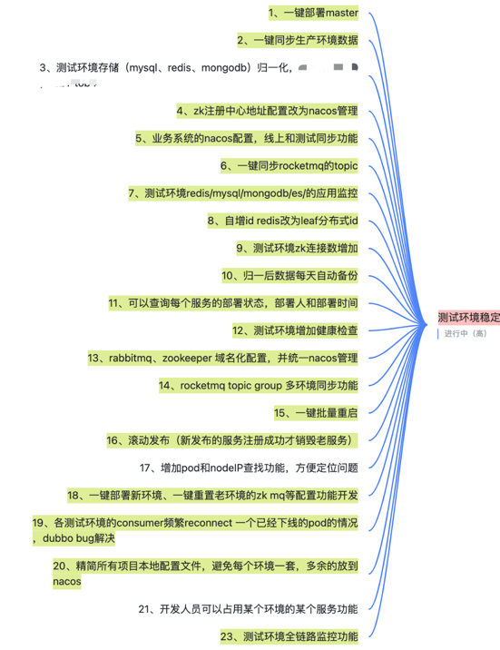

# 1、背景
&emsp;&emsp;我们30+人的开发小组，在进行业务需求迭代时，同时在维护8套开发环境+4套测试环境，共计12套环境。现面临如下问题：

（1）新增一个环境时，需要在新环境，需要配置店铺，商品，券，履约等服务的很多配置项，才能跑起来，配置过程时间较长，还可能因为各种报错导致失败；

（2）共有12套mysql,redis,mongodb，每次迭代的业务要同步到各环境，需要手动同步，同步过程时间较长，还可能因为报错导致失败；另外经常因为忘记同步导致有些环境的数据极其老旧；

（3）各个环境的配置，由不同的人维护，不同的人配置，导致各个环境的配置不一致，各环境的稳定性也不同；

（4）中间件体系不完善，如果直接采用永道或流量染色方案来维护各环境的稳定性并不现实，成本极高。

（5）新开发一个业务需求时，经常会遇到无法在某个环境进行开发的问题，原因是该环境的配置参数信息和数据都和线上运行的相差甚远，导致新需求依赖的配置或数据无法找到，如果同步差异，又很耽误时间，只能大家争抢那1，2个固定的经常迭代的环境。

# 2、目标
- 可以快速创建一套新环境（10分钟内）
- 各环境都稳定且数据一致
- 最小化各环境维护成本，由专人维护测试环境但基本不占用维护人的工作量

# 3、治理过程
1. 由于各环境配置在nacos中托管，定时同步nacos配置到各环境，实现各环境配置一致
2. 代码迭代后，每晚定时构建最新代码到各环境，实现各环境代码一致
3. mysql/redis/mongodb 由12套收敛为2套，开发测试各1套，减少数据同步成本；同时实现一键同步线上数据结构到测试环境，实现各环境数据一致
4. 执行其他稳定性专项转解行动，见下图

  

    
  

# 4、治理成果
&emsp;&emsp;经过已上治理过程，已达到预期目标。相比治理前的状况，经过治理后，各环境稳定且数据一致，达到了环境维护成本最小化。